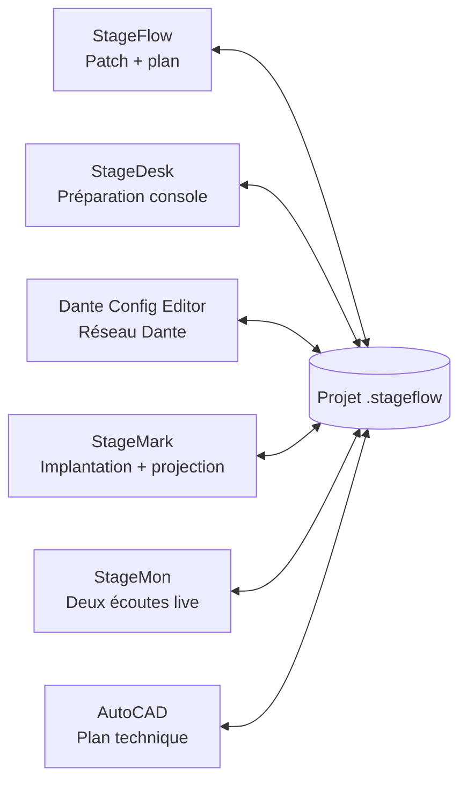
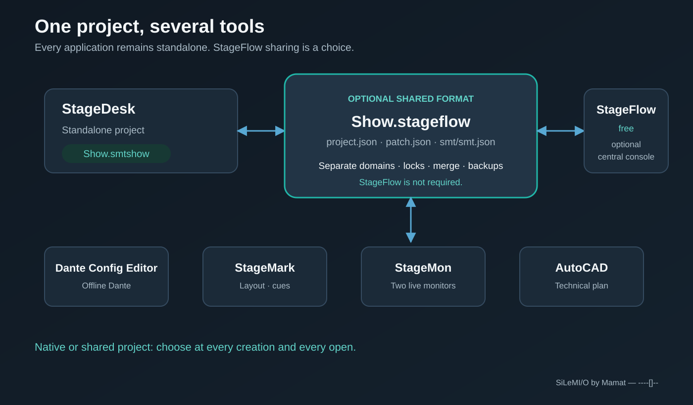
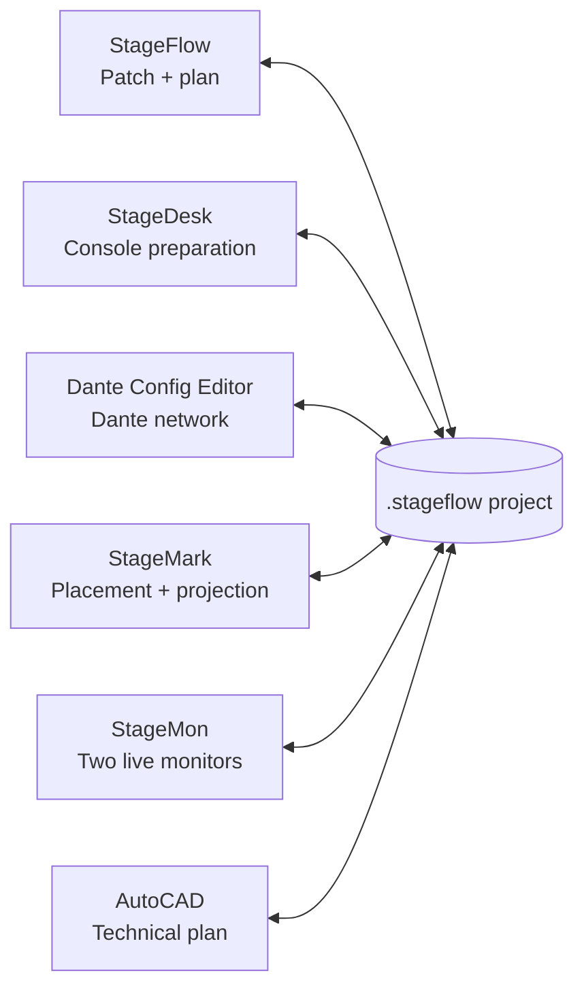

  <a href="#francais">Français</a> · <a href="#english">English</a>

  
  <h1>StageDesk v2026.9</h1>
  
<strong>Save My Time</strong>

  
Transférez vos labels et réglages essentiels entre consoles et logiciels audio.

  
Préparez une fois. Adaptez. Transférez.

  

    
    
    
  

  

    <a href="#english">English</a> ·
    <a href="https://github.com/Mamat79/StageDesk/releases/latest">Télécharger</a> ·
    <a href="docs/StageDesk-Demarrage-Rapide-FR.pdf">Démarrage rapide</a> ·
    <a href="docs/StageDesk-Guide-Professionnel-FR.pdf">Notice professionnelle</a> ·
    <a href="docs/Guide-Suite-SiLeMIO-FR.pdf">Guide de la suite SiLeMIO</a>
  

## Une préparation, plusieurs destinations

StageDesk centralise les informations utiles de vos projets audio dans un tableau
universel, puis les adapte à la console ou au logiciel de destination.

Labels, couleurs, icônes et réglages essentiels peuvent ainsi être récupérés,
corrigés et transférés sans ressaisie canal par canal. Que vous prépariez une
tournée, une captation, un festival, un studio ou une production broadcast,
StageDesk conserve une organisation cohérente d'une machine à l'autre.

### Le bénéfice immédiat

- Préparez les données une seule fois et réutilisez-les vers plusieurs destinations.
- Évitez les longues ressaisies et les erreurs de nommage.
- Respectez automatiquement le format et la capacité du modèle sélectionné.
- Conservez votre préparation lorsque la source ou la destination change.
- Protégez chaque projet remplacé grâce à une sauvegarde automatique `Bckp_`.

## Un flux simple en trois étapes

| 1 · Récupérer | 2 · Adapter | 3 · Transférer |
|---|---|---|
| Sélectionnez une console, un logiciel, un projet, une scène, un snapshot, une session ou un tableau. | Contrôlez et modifiez les données dans le tableau universel StageDesk. | Choisissez la destination, son modèle exact, l'un des modes affichés et un état cible proposé, puis exportez votre préparation. |

Le tableau reste disponible lorsque vous changez de destination. Une seule
source peut ainsi servir à préparer successivement plusieurs consoles et
logiciels.

## Les données utiles, au même endroit

StageDesk rassemble notamment :

- les labels de canaux ;
- les couleurs ;
- les icônes ;
- les affectations DCA ou VCA ;
- le coupe-bas ;
- le mute ;
- le niveau de fader ;
- l'inclusion ou l'exclusion des canaux ;
- les scènes et snapshots présents dans les projets.

Chaque destination reçoit les données adaptées à son format, à son modèle et à
sa capacité.

## Conçu pour aller vite

- Le tableau suit automatiquement le nombre réel de canaux du projet importé.
- Les cellules se modifient directement, avec un copier-coller façon tableur.
- Les paramètres réellement récupérés et transférables depuis la source
  choisie sont cochés par défaut ; les champs absents ou non pris en charge
  restent décochés. Les choix par paramètre restent accessibles sous
  **Détails**.
- Les actions groupées permettent d'inclure, d'exclure, de cocher ou de
  décocher rapidement une sélection.
- La recopie intelligente prolonge les suites comme `Mic 1`, `Mic 2`, `Mic 3`
  ou `FX1L`, `FX1R`, `FX2L`, `FX2R`.
- Les correspondances de couleurs, d'icônes et de valeurs peuvent être
  mémorisées pour les transferts suivants.
- StageDesk propose deux parcours de projet complets : le fichier autonome `.smtshow`
  pour travailler uniquement dans StageDesk, et le dossier partagé `.stageflow` pour
  échanger le patch avec la suite. Les deux se créent, s'ouvrent et
  s'enregistrent directement dans StageDesk ; StageFlow reste facultatif.
- Les anciens fichiers `.smt` restent importables.
- Le classeur portable StageFlow V3 crée une feuille **Commun** et une feuille
  par groupe. StageDesk et StageFlow le relisent dans les deux sens en
  conservant les UUID, les surcharges et les exclusions.
- L'interface est disponible en français et en anglais, avec thèmes Système,
  Clair et Sombre.
- La recherche de mise à jour intégrée télécharge le paquet officiel adapté à
  la plateforme et vérifie son empreinte SHA-256 avant de l'ouvrir.

## Des projets adaptés à votre méthode de travail

StageDesk présente uniquement les parcours fichier disponibles pour la destination
choisie. Choisissez l’un des modes réellement affichés pour le profil
sélectionné : **Nouveau projet** ou **Projet existant**.

- création d'un nouveau projet avec son nom et son état initial lorsqu’il est proposé ;
- mise à jour du projet existant choisi, après confirmation et backup automatique ;
- sélection d'une scène, d'un snapshot ou d'un cue, avec création d’un nouvel
  état uniquement lorsque l’action est affichée ;

Après l’export, StageDesk affiche le chemin de sortie et un résumé du résultat. Les
exports Nuendo et Harrison affichent en plus une procédure détaillée d’import
ou d’ouverture.

## Profils de projets disponibles dans StageDesk

Choisissez le profil exact dans StageDesk afin que le tableau de travail et le projet
exporté respectent la capacité et la structure native de la destination.

### Allen & Heath

- Avantis, Avantis dPack, Avantis Solo et Avantis Solo dPack avec import natif
  des shows Bridge-3/4/5, transfert vers Current ou un snapshot existant,
  création d'un snapshot nommé et création de nouveaux shows depuis le modèle
  standard ou dPack correspondant ;
- dLive C1500, CTi1500, C2500, C3500, S3000, S5000 et S7000, avec import natif
  des shows, transfert des labels et couleurs dans Current ou un snapshot, et
  création d'un snapshot nommé et création d'un nouveau show. Le moteur natif
  commun de 128 entrées ne stocke pas l'identité de la surface ou du MixRack :
  StageDesk applique la capacité du modèle choisi dans l'interface ;
- profils dLive MixRack DM0, DM32, DM48, DM64, CDM32, CDM48 et CDM64 ;
- GLD-80 et GLD-112 ;
- Qu-16, Qu-24, Qu-32, Qu-Pac et Qu-SB : import natif, transfert des labels vers
  Current ou une scène existante et création d'une scène dans une copie ;
- SQ-5, SQ-6, SQ-7 et SQ-Rack.

### Avid

- six profils moteur VENUE S6L pour l’import des labels MicLine de Current et
  leur transfert dans une copie ou un nouveau projet `.dsh` : E6L-112,
  E6LX-128, E6L-144, E6LX-176, E6L-192 et E6LX-256. Les six capacités (112,
  128, 144, 176, 192 et 256 entrées) ont été chargées nativement dans VENUE
  Offline 8.2, avec relecture des labels MicLine transférés ;
- l'identité des surfaces S6L-16C, S6L-24C, S6L-24D, S6L-32D et S6L-48D est
  conservée comme information de portabilité, et non comme profil de projet séparé.

### Behringer

- WING, WING Compact et WING Rack ;
- X32, X32 Compact, X32 Producer, X32 Rack et X32 Core.

### DiGiCo

- gamme V2242 complète : SD5, SD5CS, SD8, SD9, SD10, SD11, SD12, Quantum 1,
  Quantum 2, Quantum 3, Quantum 5, Quantum 7 et Quantum 8 ;
- import des labels ASCII depuis Current ou un snapshot nommé d’une session
  `.ses` existante ;
- transfert vers un snapshot nommé existant, avec sauvegarde voisine `Bckp_`
  vérifiée avant remplacement ;
- création d’un nouveau projet `.ses` depuis le seed usine exact du modèle
  sélectionné, avec une capacité de 32 à 108 entrées selon ce modèle ;
- la création d’un nouveau snapshot par duplication est proposée uniquement
  lorsque StageDesk reconnaît la topologie nécessaire dans la session.

### Midas

- M32, M32 LIVE, M32R, M32R LIVE et M32C ;
- HD96-16, HD96-24 et HD96-AIR : import des shows natifs, transfert vers une
  scène existante ou une nouvelle scène d'une copie, et import/export du
  classeur Excel constructeur.

### Soundcraft

- Vi1000, Vi200, Vi2000, Vi3000, Vi400, Vi5000, Vi600 et Vi7000.

### SSL

- projets SSL Live `.show` natifs sous Windows avec SOLSA 6.x installé : L100,
  L100 Plus, L200, L200 Plus, L300, L350, L350 Plus, L350 Plus E, L450, L500,
  L500 Plus, L550, L550 Plus et L650 ;
- SSL sous Windows uniquement. System T avec T-SOLSA : T25, T80, TE1 et TE2
  en 48 ou 96 kHz ; VTE1 et VTE2 en 48 kHz.

### Yamaha

- CL1, CL3 et CL5, avec import local, création et transfert de projets `.CLF`
  natifs ;
- QL1 et QL5, avec import local, création et transfert de projets `.CLF`
  natifs ;
- DM3 et DM3 Standard : import, transfert et création de projets natifs ;
- DM7 et DM7 Compact : import, transfert et création de projets et scènes natifs ;
- TF1, TF3, TF5 et TF-RACK : import, transfert et création de projets et scènes natifs ;
- RIVAGE PM7/CSD-R7 ; PM3/CS-R3 et PM5/CS-R5 avec DSP-R10, DSP-RX ou
  DSP-RX-EX ; PM10/CS-R10 et PM10/CS-R10-S avec ces trois moteurs, avec import
  local, création et transfert de projets natifs.

### Logiciels et formats d'échange

| Logiciel ou échange | Utilisation avec StageDesk |
|---|---|
| **Ableton Live** | Import et mise à jour avec backup ; Nouveau projet crée depuis le modèle embarqué un Live Set `.als` audio uniquement de deux pistes. Le set généré a été ouvert, fermé puis rouvert nativement dans Ableton Live 12.4 avec relecture des deux labels. |
| **Dante Config Editor — DCE** | Import XML DCE natif : choisissez une machine et récupérez uniquement ses canaux Rx. À l'export, créez un projet XML DCE depuis la banque de machines embarquée, ou ciblez une machine existante ou ajoutez un modèle de la banque dans un projet existant. Création et remplacement ont été relus dans DCE ; les labels Rx sont mis à jour tandis que tous les canaux Tx sont préservés à l'identique. L'échange CSV reste disponible. StageDesk peut créer et lire ces XML sans que Dante Config Editor soit installé et propose son lien officiel pour les ouvrir et les modifier. |
| **Excel et CSV** | Import, édition et export du tableau universel StageDesk. |
| **Harrison LiveTrax 3** | Import, mise à jour avec backup et création de sessions `.ardour`, dimensionnées selon les pistes à transférer. |
| **Harrison Mixbus 10** | Import, mise à jour avec backup et création de sessions `.ardour`, avec export Lua disponible. |
| **MAGIX Sequoia Pro 17** | Import, mise à jour avec backup et création de projets `.VIP`. |
| **REAPER** | Import, mise à jour avec backup et création de projets `.rpp`, avec labels, couleurs, images de pistes, mutes et faders. |
| **Steinberg Nuendo 14** | Création et import de projets d'échange `.dawproject` avec noms, couleurs, mutes et niveaux. Dans Nuendo, utilisez **Fichier > Importer > DAWproject**. |

## Démarrage rapide

1. Choisissez le système et le modèle source.
2. Choisissez l'un des modes source affichés, puis le fichier ou l'état Current proposé.
3. Importez les données dans le tableau universel.
4. Corrigez les labels et réglages nécessaires.
5. Choisissez la destination et son modèle exact.
6. Choisissez l’un des modes réellement affichés pour ce profil, puis le projet
   cible et l’un des états proposés par le connecteur.
7. Ouvrez ou rappelez le résultat lorsqu'il y en a un, puis vérifiez plusieurs canaux représentatifs.

## Télécharger StageDesk

Téléchargez StageDesk v2026 depuis la
[page officielle des téléchargements](https://github.com/Mamat79/StageDesk/releases/latest).

La version actuelle est proposée pour **Windows x64**, **macOS Intel** et
**macOS Apple Silicon**.

Consultez la [notice professionnelle en français](docs/StageDesk-Guide-Professionnel-FR.pdf)
pour découvrir le parcours complet et les fonctions de StageDesk.

## Licence permanente

- 30 jours sans rappel au premier lancement ;
- après 30 jours, StageDesk et toutes ses fonctions restent utilisables ;
- le rappel de démarrage reste affiché 10 secondes avant de pouvoir continuer ;
- une licence permanente coûte **29 € TTC** et supprime ce rappel ;
- le code de licence est envoyé après l’achat ;
- StageDesk affiche les activations disponibles, puis permet de **désactiver cet
  ordinateur** pour libérer une place ;
- après l’activation initiale, StageDesk fonctionne hors ligne ;
- les mises à jour et réinstallations qui conservent les données locales
  conservent aussi l’activation.

[Acheter une licence StageDesk — 29 € TTC](https://smt-license.mamat79-dce.workers.dev/buy)

## Écosystème SiLeMI/O

Un seul dossier projet peut être ouvert par un ou plusieurs logiciels. Chaque
application reste autonome, écrit uniquement son domaine et surveille les
changements réalisés par les autres. En cas de modification concurrente, StageDesk
refuse l'écrasement silencieux.

### StageFlow LIVE, sans perdre l’autonomie

StageDesk distingue désormais **LIVE local** et **LIVE réseau**. Le LIVE
local suit un dossier `.stageflow` ouvert sur le même poste. Le LIVE réseau se
rejoint volontairement depuis le panneau StageFlow, après découverte sur le
LAN, sélection de la session et saisie du code à six chiffres affiché par le
maître. Ce code n’est jamais enregistré.

- **Suivre les sessions StageFlow LIVE** est activé par défaut et reste un choix local.
- En LIVE, chaque patch externe valide est fusionné immédiatement dans le
  tableau visible, sans rappeler le snapshot ni recharger manuellement le
  projet.
- Les modifications locales et externes portant sur des champs différents sont
  conservées ensemble. En cas de modification concurrente du même champ, la
  valeur locale est conservée et **Conflit LIVE** signale clairement le point à
  arbitrer ; les autres changements continuent d'être appliqués.
- Sans session LIVE valide, ou lorsque le suivi est désactivé, StageDesk reste
  entièrement manuel et autonome ; le bouton **Recharger** applique le projet
  externe uniquement sur demande.
- StageDesk ne démarre pas une session LIVE et n’envoie aucune commande à une console,
  un réseau ou un DAW par ce mécanisme.
- En LIVE réseau, seuls `patch.json` et `smt/smt.json` peuvent être publiés par
  StageDesk. Les domaines tiers restent opaques et intacts ; les classeurs
  Excel référencés sont transférés séparément avec contrôle de taille et de
  SHA-256.
- Les alertes LIVE sont éphémères et limitées aux véritables changements de
  labels. Le maître les active ou les désactive ; un mode désactivé est un état
  normal, pas une erreur.
- **Enregistrer sous** produit une copie autonome `.smtshow`, puis détache le
  poste du LIVE réseau sans perdre le tableau courant.

- [Télécharger StageFlow — gratuit et optionnel](https://github.com/Mamat79/StageFlow/releases/latest)
- [Télécharger Dante Config Editor](https://github.com/Mamat79/Dante-Config-Editor/releases/latest)
- [Télécharger StageMark](https://github.com/Mamat79/StageMark/releases/latest)
- [Télécharger StageMon](https://github.com/Mamat79/StageMon/releases/latest)
- [Lire le guide de la suite SiLeMIO](docs/guides/GUIDE-SUITE-FR.md)

Dans StageDesk, **Nouveau/Ouvrir un projet StageDesk** utilise un fichier `.smtshow`
entièrement autonome. **Nouveau/Ouvrir un projet StageFlow** utilise un dossier
`.stageflow` et **Enregistrer** met à jour `patch.json` et `smt/smt.json` avec
  les verrous `patch`, `smt`, puis `project`, une fusion à trois voies, une
sauvegarde et un contrôle d'empreinte. Les chemins externes
mémorisés ne déclenchent jamais une connexion automatiquement.

StageDesk fait partie de la gamme **SiLeMI/O by Mamat**.

`----[]--`

---

  
  <h1>StageDesk v2026.9</h1>
  
<strong>Save My Time</strong>

  
Transfer labels and essential settings between audio consoles and software.

  
Prepare once. Adapt. Transfer.

  

    
    
    
  

  

    <a href="#francais">Français</a> ·
    <a href="https://github.com/Mamat79/StageDesk/releases/latest">Download</a> ·
    <a href="docs/StageDesk-Quick-Start-EN.pdf">Quick start</a> ·
    <a href="docs/StageDesk-Professional-Guide-EN.pdf">Professional guide</a> ·
    <a href="docs/SiLeMIO-Suite-Guide-EN.pdf">SiLeMIO suite guide</a>
  

## One preparation, multiple destinations

StageDesk gathers the useful information from your audio projects into one universal
table, then adapts it to the selected console or software destination.

Labels, colours, icons and essential settings can be retrieved, edited and
transferred without entering the same information again, channel by channel.
Whether you are preparing a tour, broadcast, recording session, festival or
studio production, StageDesk keeps your channel organisation consistent across
different systems.

### The immediate benefit

- Prepare the data once and reuse it across multiple destinations.
- Avoid lengthy manual entry and channel-naming errors.
- Automatically follow the format and capacity of the selected model.
- Keep the preparation available when the source or destination changes.
- Protect every replaced project with an automatic `Bckp_` backup.

## A simple three-step workflow

| 1 · Retrieve | 2 · Adapt | 3 · Transfer |
|---|---|---|
| Select a console, software application, project, scene, snapshot, session or spreadsheet. | Review and edit the data in the universal StageDesk table. | Choose the destination, its exact model, one of the displayed modes and an offered target state, then export the preparation. |

The table remains available when the destination changes. One source can
therefore be used to prepare several consoles and software applications in
succession.

## The essential data in one place

StageDesk brings together:

- channel labels;
- colours;
- icons;
- DCA or VCA assignments;
- high-pass settings;
- mute states;
- fader levels;
- channel inclusion and exclusion;
- scenes and snapshots available in a project.

Each destination receives data adapted to its format, selected model and
channel capacity.

## Built for speed

- The table automatically follows the actual channel count of the imported project.
- Cells can be edited directly with spreadsheet-style copy and paste.
- Parameters actually retrieved and transferable from the selected source are
  selected by default; absent or unsupported fields remain unselected.
  Per-parameter choices remain available under **Details**.
- Group actions quickly include, exclude, select or clear a channel selection.
- Smart fill continues sequences such as `Mic 1`, `Mic 2`, `Mic 3` or
  `FX1L`, `FX1R`, `FX2L`, `FX2R`.
- Colour, icon and value mappings can be remembered for subsequent transfers.
- StageDesk provides two complete project workflows: a standalone `.smtshow` file for
  StageDesk-only work and a shared `.stageflow` folder for exchanging the patch with
  the suite. Both can be created, opened and saved directly in StageDesk; StageFlow
  remains optional.
- Existing `.smt` files remain importable.
- The portable StageFlow V3 workbook creates one **Commun** sheet and one sheet
  per group. StageDesk and StageFlow read it both ways while preserving
  UUIDs, overrides and exclusions.
- The interface is available in English and French with System, Light and Dark
  themes.
- The built-in update check downloads the official package for the current
  platform and verifies its SHA-256 before opening it.

## Projects that fit your workflow

StageDesk presents only the file workflows available for the selected destination.
Choose one of the modes actually shown for the selected profile: **New
Project** or **Existing Project**.

- create a new project with its own name and initial state when offered;
- update the selected existing project after confirmation and automatic backup;
- select a scene, snapshot or cue, and create a new state only when that action
  is shown;

After export, StageDesk displays the output path and a result summary. Nuendo and
Harrison exports additionally display detailed import or opening steps.

## Project profiles available in StageDesk

Choose the exact profile in StageDesk so the working table and the exported project
follow the destination's channel capacity and native structure.

### Allen & Heath

- Avantis and Avantis dPack with native Bridge-3/4/5 show import and new-show
  creation; standard Avantis can also create a new named snapshot in an
  existing show;
- Avantis, Avantis dPack, Avantis Solo and Avantis Solo dPack support native
  Bridge-3/4/5 show import, Current or existing-snapshot updates, named snapshot
  creation and New Project from the matching standard or dPack template;
- dLive C1500, CTi1500, C2500, C3500, S3000, S5000 and S7000, with native show
  import, label and colour transfer to Current or a snapshot, and named-snapshot
  creation and New Project. The common 128-input show engine does not store a
  surface or MixRack identity; StageDesk enforces the model selected in the UI;
- dLive MixRack DM0, DM32, DM48, DM64, CDM32, CDM48 and CDM64 profiles;
- GLD-80 and GLD-112;
- Qu-16, Qu-24, Qu-32, Qu-Pac and Qu-SB: native import, label transfer to
  Current or an existing scene, and scene creation in a copy;
- SQ-5, SQ-6, SQ-7 and SQ-Rack.

### Avid

- six VENUE S6L engine profiles for Current MicLine label import and
  copy/new-project transfer in `.dsh` files: E6L-112, E6LX-128, E6L-144,
  E6LX-176, E6L-192 and E6LX-256. A native VENUE Offline 8.2 load has been
  completed for all six capacities (112, 128, 144, 176, 192 and 256 inputs),
  including readback of the transferred Current MicLine labels;
- S6L-16C, S6L-24C, S6L-24D, S6L-32D and S6L-48D surface identity is carried
  as portability information rather than as a separate project profile.

### Behringer

- WING, WING Compact and WING Rack;
- X32, X32 Compact, X32 Producer, X32 Rack and X32 Core.

### DiGiCo

- complete V2242 range: SD5, SD5CS, SD8, SD9, SD10, SD11, SD12, Quantum 1,
  Quantum 2, Quantum 3, Quantum 5, Quantum 7 and Quantum 8;
- ASCII-label import from Current or a named snapshot in an existing `.ses`
  session;
- transfer to an existing named snapshot, with a verified sibling `Bckp_`
  backup before replacement;
- new `.ses` project creation from the exact factory seed of the selected
  model, with a 32-to-108-input capacity depending on that model;
- new-snapshot duplication is offered only when StageDesk recognises the required
  topology in the session.

### Midas

- M32, M32 LIVE, M32R, M32R LIVE and M32C;
- HD96-16, HD96-24 and HD96-AIR: native-show import, transfer to an existing or
  new scene in a copy, and manufacturer Excel workbook import/export.

### Soundcraft

- Vi1000, Vi200, Vi2000, Vi3000, Vi400, Vi5000, Vi600 and Vi7000.

### SSL

- Native SSL Live `.show` projects on Windows through an installed SOLSA 6.x:
  L100, L100 Plus, L200, L200 Plus, L300, L350, L350 Plus, L350 Plus E, L450,
  L500, L500 Plus, L550, L550 Plus and L650;
- SSL on Windows only. System T through T-SOLSA: T25, T80, TE1 and TE2 at 48
  or 96 kHz; VTE1 and VTE2 at 48 kHz.

### Yamaha

- CL1, CL3 and CL5, with local native `.CLF` import, project creation and
  transfer;
- QL1 and QL5, with local native `.CLF` import, project creation and transfer;
- DM3 and DM3 Standard: native project import, transfer and creation;
- DM7 and DM7 Compact: native project/scene import, transfer and creation;
- TF1, TF3, TF5 and TF-RACK: native project/scene import, transfer and creation;
- RIVAGE PM7/CSD-R7; PM3/CS-R3 and PM5/CS-R5 with DSP-R10, DSP-RX or
  DSP-RX-EX; PM10/CS-R10 and PM10/CS-R10-S with the same three engines, with
  local native project import, creation and transfer.

### Software and exchange formats

| Software or exchange | StageDesk workflow |
|---|---|
| **Ableton Live** | Import and update with backup; New Project creates a two-track audio-only `.als` Live Set from the bundled template. The generated two-track set has been opened, closed and reopened natively in Ableton Live 12.4 with both labels read back. |
| **Dante Config Editor — DCE** | Native DCE XML import: choose a machine and retrieve its Rx channels only. For export, create a DCE XML project from the bundled machine bank, or target an existing machine or add a bank model to an existing project. Creation and replacement have been read back in Dante Config Editor; Rx labels are updated while every Tx channel is preserved byte-for-byte. CSV exchange remains available. StageDesk can create and read these XML projects without Dante Config Editor installed and provides its official download link for opening and editing them. |
| **Excel and CSV** | Import, editing and export of the universal StageDesk table. |
| **Harrison LiveTrax 3** | Import, update with backup and creation of `.ardour` sessions sized to the tracks being transferred. |
| **Harrison Mixbus 10** | Import, update with backup and creation of `.ardour` sessions, with an additional Lua export. |
| **MAGIX Sequoia Pro 17** | Import, update with backup and creation of `.VIP` projects. |
| **REAPER** | Import, update with backup and creation of `.rpp` projects with labels, colours, track images, mutes and faders. |
| **Steinberg Nuendo 14** | Creation and import of `.dawproject` exchange projects with names, colours, mutes and levels. In Nuendo, use **File > Import > DAWproject**. |

## Quick start

1. Select the source system and model.
2. Choose one of the displayed source modes, then the offered file or Current state.
3. Import the data into the universal table.
4. Review and edit the required labels and settings.
5. Select the destination and its exact model.
6. Choose one of the modes actually displayed for that profile, then select
   the target project and one of the states offered by the connector.
7. Open or recall the result when applicable, then verify representative channels.

## Download StageDesk

Download StageDesk v2026 from the
[official download page](https://github.com/Mamat79/StageDesk/releases/latest).

The current release is available for **Windows x64**, **macOS Intel**, and
**macOS Apple Silicon**.

Read the [professional guide in English](docs/StageDesk-Professional-Guide-EN.pdf)
for the complete workflow and StageDesk features.

## Permanent license

- 30 reminder-free days after first launch;
- after 30 days, StageDesk and every feature remain usable;
- the startup reminder stays open for 10 seconds before continuing;
- a permanent license costs **€29 including tax** and removes the reminder;
- the license code is sent after purchase;
- StageDesk shows available activations and provides **Deactivate this
  computer** to release a seat;
- after initial activation, StageDesk works offline;
- updates and reinstalls that preserve local data also preserve activation.

[Buy a StageDesk license — €29 including tax](https://smt-license.mamat79-dce.workers.dev/buy)

## SiLeMI/O ecosystem

One project folder can be opened by one or several applications. Every app
remains standalone, writes only its own domain, and watches changes made by the
others. StageDesk refuses a silent overwrite when concurrent edits are detected.

### StageFlow LIVE without losing standalone operation

StageDesk now distinguishes **Local LIVE** from **Network LIVE**. Local LIVE
follows a `.stageflow` folder on the same computer. Network LIVE is joined only
after an explicit LAN discovery, session selection, and entry of the six-digit
code displayed by the master. The pairing code is never stored.

- **Follow StageFlow LIVE sessions** is enabled by default and remains a local preference.
- In LIVE, every valid external patch is merged immediately into the visible
  table, without recalling the snapshot or manually reloading the project.
- Local and external edits to different fields are kept together. If both sides
  edit the same field, the local value is preserved and **LIVE conflict** marks
  the item for review while all non-conflicting changes still apply.
- Without a valid LIVE session, or when following is disabled, StageDesk stays fully
  manual and standalone; **Reload** applies the external project only on request.
- StageDesk never starts a LIVE session and this mechanism sends no command to a
  console, network, or DAW.
- In Network LIVE, StageDesk can publish only `patch.json` and
  `smt/smt.json`. Third-party domains remain opaque and untouched; referenced
  Excel workbooks travel separately with size and SHA-256 verification.
- LIVE alerts are ephemeral and strictly limited to genuine label changes. The
  master enables or disables them; disabled alert mode is a normal state.
- **Save As** creates an autonomous `.smtshow` copy and then detaches from
  Network LIVE without losing the current table.

- [Download StageFlow — free and optional](https://github.com/Mamat79/StageFlow/releases/latest)
- [Download Dante Config Editor](https://github.com/Mamat79/Dante-Config-Editor/releases/latest)
- [Download StageMark](https://github.com/Mamat79/StageMark/releases/latest)
- [Download StageMon](https://github.com/Mamat79/StageMon/releases/latest)
- [Read the SiLeMIO suite guide](docs/guides/SUITE-GUIDE-EN.md)

In StageDesk, **New/Open a StageDesk project** uses a fully standalone `.smtshow` file.
**New/Open a StageFlow project** uses a `.stageflow` folder, and **Save** updates
`patch.json` and `smt/smt.json` with `patch`, `smt`, then `project` locks, a
three-way merge, backup and hash checks.
Stored external paths never start a connection automatically.

StageDesk is part of the **SiLeMI/O by Mamat** software family.

`----[]--`
