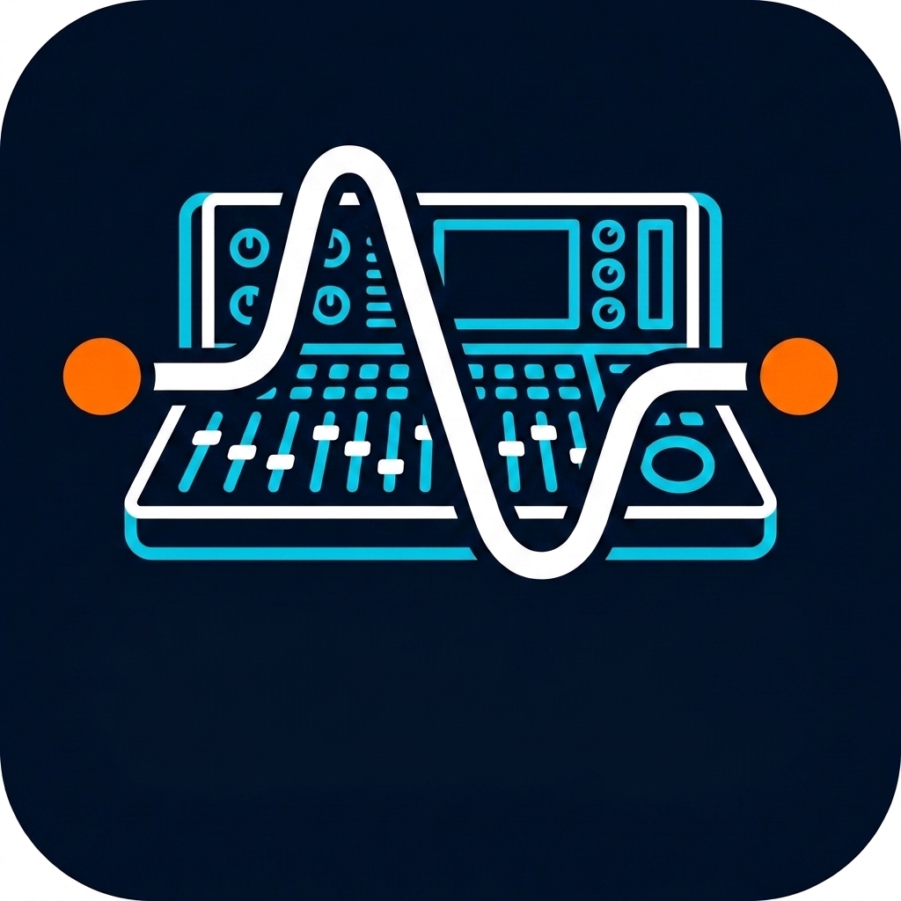
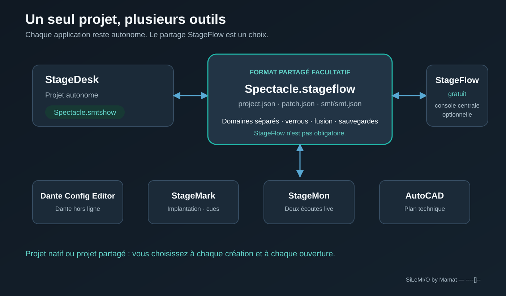
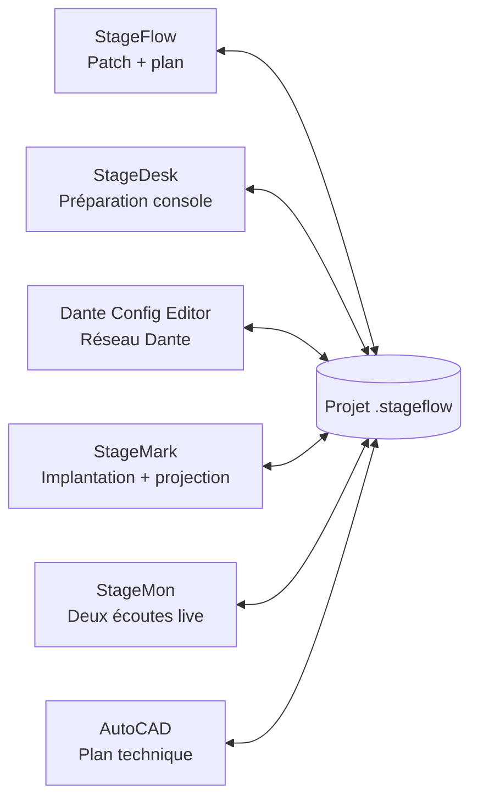

  
  <h1>StageDesk v2027</h1>
  
Transférez vos labels et réglages essentiels entre consoles et logiciels audio.

  
Préparez une fois. Adaptez. Transférez.

  

    
    
    
  

  

    <a href="README.md">English</a> ·
    <a href="https://www.silemio.com/logiciels/stagedesk">Télécharger</a> ·
    <a href="docs/StageDesk-Demarrage-Rapide-FR.pdf">Démarrage rapide</a> ·
    <a href="docs/StageDesk-Guide-Professionnel-FR.pdf">Notice professionnelle</a> ·
    <a href="docs/Guide-Suite-SiLeMIO-FR.pdf">Guide de la suite SiLeMIO</a>
  

## Une préparation, plusieurs destinations

StageDesk centralise les informations utiles de vos projets audio dans un tableau
universel, puis les adapte à la console ou au logiciel de destination.

Labels, couleurs, icônes et réglages essentiels peuvent ainsi être récupérés,
corrigés et transférés sans ressaisie canal par canal. Que vous prépariez une
tournée, une captation, un festival, un studio ou une production broadcast,
StageDesk conserve une organisation cohérente d'une machine à l'autre.

### Le bénéfice immédiat

- Préparez les données une seule fois et réutilisez-les vers plusieurs destinations.
- Évitez les longues ressaisies et les erreurs de nommage.
- Respectez automatiquement le format et la capacité du modèle sélectionné.
- Conservez votre préparation lorsque la source ou la destination change.
- Protégez chaque projet remplacé grâce à une sauvegarde automatique `Bckp_`.

## Connexion directe aux consoles sur le LAN

Le mode **Réseau** propose une IP manuelle ou une détection volontaire, puis la
lecture de Current et l'envoi des paramètres cochés. Il couvre Yamaha DM7,
RIVAGE PM, CL/QL, TF, DM3, Allen & Heath dLive/Avantis, X32/M32 et WING, avec des
champs et capacités différents selon la famille. X32/M32 ajoute un import de scène
par rappel explicite et la mémorisation de Current dans un emplacement vide.

Chaque écriture exige une confirmation et une sauvegarde des champs relus.
Cette sauvegarde n'est pas un show complet. Les tests logiciels TCP/UDP ne
remplacent pas la recette hors antenne sur une console physique, qui reste à faire.
Consultez les [procédures et limites réseau](docs/NETWORK_CONSOLES.md).

## Un flux simple en trois étapes

| 1 · Récupérer | 2 · Adapter | 3 · Transférer |
|---|---|---|
| Sélectionnez une console, un logiciel, un projet, une scène, un snapshot, une session ou un tableau. | Contrôlez et modifiez les données dans le tableau universel StageDesk. | Choisissez la destination, son modèle exact, l'un des modes affichés et un état cible proposé, puis exportez votre préparation. |

Le tableau reste disponible lorsque vous changez de destination. Une seule
source peut ainsi servir à préparer successivement plusieurs consoles et
logiciels.

## Les données utiles, au même endroit

StageDesk rassemble notamment :

- les labels de canaux ;
- les couleurs ;
- les icônes ;
- les affectations DCA ou VCA ;
- le coupe-bas ;
- le mute ;
- le niveau de fader ;
- l'inclusion ou l'exclusion des canaux ;
- les scènes et snapshots présents dans les projets.

Chaque destination reçoit les données adaptées à son format, à son modèle et à
sa capacité.

## Conçu pour aller vite

- Le tableau suit automatiquement le nombre réel de canaux du projet importé.
- Les cellules se modifient directement, avec un copier-coller façon tableur.
- Les paramètres réellement récupérés et transférables depuis la source
  choisie sont cochés par défaut ; les champs absents ou non pris en charge
  restent décochés. Les choix par paramètre restent accessibles sous
  **Détails**.
- Les actions groupées permettent d'inclure, d'exclure, de cocher ou de
  décocher rapidement une sélection.
- La recopie intelligente prolonge les suites comme `Mic 1`, `Mic 2`, `Mic 3`
  ou `FX1L`, `FX1R`, `FX2L`, `FX2R`.
- Les correspondances de couleurs, d'icônes et de valeurs peuvent être
  mémorisées pour les transferts suivants.
- StageDesk propose deux parcours de projet complets : le fichier autonome `.smtshow`
  pour travailler uniquement dans StageDesk, et le dossier partagé `.stageflow` pour
  échanger le patch avec la suite. Les deux se créent, s'ouvrent et
  s'enregistrent directement dans StageDesk ; StageFlow reste facultatif.
- Les anciens fichiers `.smt` restent importables.
- Le classeur portable StageFlow V3 crée une feuille **Commun** et une feuille
  par groupe. StageDesk et StageFlow le relisent dans les deux sens en
  conservant les UUID, les surcharges et les exclusions.
- L'interface est disponible en français et en anglais, avec thèmes Système,
  Clair et Sombre.
- La recherche de mise à jour intégrée télécharge le paquet officiel adapté à
  la plateforme et vérifie son empreinte SHA-256 avant de l'ouvrir.

## Des projets adaptés à votre méthode de travail

StageDesk présente uniquement les parcours fichier disponibles pour la destination
choisie. Choisissez l’un des modes réellement affichés pour le profil
sélectionné : **Nouveau projet** ou **Projet existant**.

- création d'un nouveau projet avec son nom et son état initial lorsqu’il est proposé ;
- mise à jour du projet existant choisi, après confirmation et backup automatique ;
- sélection d'une scène, d'un snapshot ou d'un cue, avec création d’un nouvel
  état uniquement lorsque l’action est affichée ;

Après l’export, StageDesk affiche le chemin de sortie et un résumé du résultat. Les
exports Nuendo et Harrison affichent en plus une procédure détaillée d’import
ou d’ouverture.

## Profils de projets disponibles dans StageDesk

Choisissez le profil exact dans StageDesk afin que le tableau de travail et le projet
exporté respectent la capacité et la structure native de la destination.

### Allen & Heath

- Avantis, Avantis dPack, Avantis Solo et Avantis Solo dPack avec import natif
  des shows Bridge-3/4/5, transfert vers Current ou un snapshot existant,
  création d'un snapshot nommé et création de nouveaux shows depuis le modèle
  standard ou dPack correspondant ;
- dLive C1500, CTi1500, C2500, C3500, S3000, S5000 et S7000, avec import natif
  des shows, transfert des labels et couleurs dans Current ou un snapshot, et
  création d'un snapshot nommé et création d'un nouveau show. Le moteur natif
  commun de 128 entrées ne stocke pas l'identité de la surface ou du MixRack :
  StageDesk applique la capacité du modèle choisi dans l'interface ;
- profils dLive MixRack DM0, DM32, DM48, DM64, CDM32, CDM48 et CDM64 ;
- GLD-80 et GLD-112 ;
- Qu-16, Qu-24, Qu-32, Qu-Pac et Qu-SB : import natif, transfert des labels vers
  Current ou une scène existante et création d'une scène dans une copie ;
- SQ-5, SQ-6, SQ-7 et SQ-Rack.

### Avid

- six profils moteur VENUE S6L pour l’import des labels MicLine de Current et
  leur transfert dans une copie ou un nouveau projet `.dsh` : E6L-112,
  E6LX-128, E6L-144, E6LX-176, E6L-192 et E6LX-256. Les six capacités (112,
  128, 144, 176, 192 et 256 entrées) ont été chargées nativement dans VENUE
  Offline 8.2, avec relecture des labels MicLine transférés ;
- l'identité des surfaces S6L-16C, S6L-24C, S6L-24D, S6L-32D et S6L-48D est
  conservée comme information de portabilité, et non comme profil de projet séparé.

### Behringer

- WING, WING Compact et WING Rack ;
- X32, X32 Compact, X32 Producer, X32 Rack et X32 Core.

### DiGiCo

- gamme V2242 complète : SD5, SD5CS, SD8, SD9, SD10, SD11, SD12, Quantum 1,
  Quantum 2, Quantum 3, Quantum 5, Quantum 7 et Quantum 8 ;
- import des labels ASCII depuis Current ou un snapshot nommé d’une session
  `.ses` existante ;
- transfert vers un snapshot nommé existant, avec sauvegarde voisine `Bckp_`
  vérifiée avant remplacement ;
- création d’un nouveau projet `.ses` depuis le seed usine exact du modèle
  sélectionné, avec une capacité de 32 à 108 entrées selon ce modèle ;
- la création d’un nouveau snapshot par duplication est proposée uniquement
  lorsque StageDesk reconnaît la topologie nécessaire dans la session.

### Midas

- M32, M32 LIVE, M32R, M32R LIVE et M32C ;
- HD96-16, HD96-24 et HD96-AIR : import des shows natifs, transfert vers une
  scène existante ou une nouvelle scène d'une copie, et import/export du
  classeur Excel constructeur.

### Soundcraft

- Vi1000, Vi200, Vi2000, Vi3000, Vi400, Vi5000, Vi600 et Vi7000.

### SSL

- projets SSL Live `.show` natifs sous Windows avec SOLSA 6.x installé : L100,
  L100 Plus, L200, L200 Plus, L300, L350, L350 Plus, L350 Plus E, L450, L500,
  L500 Plus, L550, L550 Plus et L650 ;
- SSL sous Windows uniquement. System T avec T-SOLSA : T25, T80, TE1 et TE2
  en 48 ou 96 kHz ; VTE1 et VTE2 en 48 kHz.

### Yamaha

- CL1, CL3 et CL5, avec import local, création et transfert de projets `.CLF`
  natifs ;
- QL1 et QL5, avec import local, création et transfert de projets `.CLF`
  natifs ;
- DM3 et DM3 Standard : import, transfert et création de projets natifs ;
- DM7 et DM7 Compact : import, transfert et création de projets et scènes natifs ;
- TF1, TF3, TF5 et TF-RACK : import, transfert et création de projets et scènes natifs ;
- RIVAGE PM7/CSD-R7 ; PM3/CS-R3 et PM5/CS-R5 avec DSP-R10, DSP-RX ou
  DSP-RX-EX ; PM10/CS-R10 et PM10/CS-R10-S avec ces trois moteurs, avec import
  local, création et transfert de projets natifs.

### Logiciels et formats d'échange

| Logiciel ou échange | Utilisation avec StageDesk |
|---|---|
| **Ableton Live** | Import et mise à jour avec backup ; Nouveau projet crée depuis le modèle embarqué un Live Set `.als` audio uniquement de deux pistes. Le set généré a été ouvert, fermé puis rouvert nativement dans Ableton Live 12.4 avec relecture des deux labels. |
| **Dante Config Editor — DCE** | Import XML DCE natif : choisissez une machine et récupérez uniquement ses canaux Rx. À l'export, créez un projet XML DCE depuis la banque de machines embarquée, ou ciblez une machine existante ou ajoutez un modèle de la banque dans un projet existant. Création et remplacement ont été relus dans DCE ; les labels Rx sont mis à jour tandis que tous les canaux Tx sont préservés à l'identique. L'échange CSV reste disponible. StageDesk peut créer et lire ces XML sans que Dante Config Editor soit installé et propose son lien officiel pour les ouvrir et les modifier. |
| **Excel et CSV** | Import, édition et export du tableau universel StageDesk. |
| **Harrison LiveTrax 3** | Import, mise à jour avec backup et création de sessions `.ardour`, dimensionnées selon les pistes à transférer. |
| **Harrison Mixbus 10** | Import, mise à jour avec backup et création de sessions `.ardour`, avec export Lua disponible. |
| **MAGIX Sequoia Pro 17** | Import, mise à jour avec backup et création de projets `.VIP`. |
| **REAPER** | Import, mise à jour avec backup et création de projets `.rpp`, avec labels, couleurs, images de pistes, mutes et faders. |
| **Steinberg Nuendo 14** | Création et import de projets d'échange `.dawproject` avec noms, couleurs, mutes et niveaux. Dans Nuendo, utilisez **Fichier > Importer > DAWproject**. |

## Démarrage rapide

1. Choisissez le système et le modèle source.
2. Choisissez l'un des modes source affichés, puis le fichier ou l'état Current proposé.
3. Importez les données dans le tableau universel.
4. Corrigez les labels et réglages nécessaires.
5. Choisissez la destination et son modèle exact.
6. Choisissez l’un des modes réellement affichés pour ce profil, puis le projet
   cible et l’un des états proposés par le connecteur.
7. Ouvrez ou rappelez le résultat lorsqu'il y en a un, puis vérifiez plusieurs canaux représentatifs.

## Télécharger StageDesk

Téléchargez StageDesk v2027 depuis la
[page officielle des téléchargements](https://www.silemio.com/logiciels/stagedesk).

La version actuelle est proposée pour **Windows x64**, **macOS Intel** et
**macOS Apple Silicon**.

- [Installer Windows 2027.0.4 (.exe)](https://github.com/Mamat79/StageDesk/releases/download/v2027.0.4/StageDesk-Setup-v2027.0.4.exe)
- [Installer sur Mac Intel 2027.0.2 (.dmg)](https://github.com/Mamat79/StageDesk/releases/download/v2027.0.2/StageDesk-v2027.0.2-osx-x64.dmg)
- [Installer sur Mac Apple Silicon 2027.0.2 (.dmg)](https://github.com/Mamat79/StageDesk/releases/download/v2027.0.2/StageDesk-v2027.0.2-osx-arm64.dmg)

Sous Windows, lancez l'installateur. Sur Mac, ouvrez le DMG puis glissez StageDesk
dans Applications. Les fichiers SHA-256 et les instructions d'installation
accompagnent les téléchargements officiels.

Dans StageDesk, **Aide > Rechercher des mises à jour** propose la dernière version
stable adaptée à cet ordinateur et vérifie le téléchargement avant installation.

Consultez la [notice professionnelle en français](docs/StageDesk-Guide-Professionnel-FR.pdf)
pour découvrir le parcours complet et les fonctions de StageDesk.

## Licence permanente

- 30 jours sans rappel au premier lancement ;
- après 30 jours, StageDesk et toutes ses fonctions restent utilisables ;
- le rappel de démarrage reste affiché 10 secondes avant de pouvoir continuer ;
- une licence permanente coûte **29 € TTC** et supprime ce rappel ;
- le code de licence est envoyé après l’achat ;
- StageDesk affiche les activations disponibles et permet de **désactiver cet
  ordinateur** pour libérer une place ;
- après l’activation initiale, StageDesk fonctionne hors ligne ;
- les mises à jour conservent l’activation quand les données locales sont
  conservées.

[Acheter une licence StageDesk — 29 € TTC](https://smt-license.mamat79-dce.workers.dev/buy)

## Écosystème SiLeMI/O

Un seul dossier projet peut être ouvert par un ou plusieurs logiciels. Chaque
application reste autonome, écrit uniquement son domaine et surveille les
changements réalisés par les autres. En cas de modification concurrente, StageDesk
refuse l'écrasement silencieux.

### StageFlow LIVE, sans perdre l’autonomie

StageDesk distingue trois parcours : **Projet StageDesk** (`.smtshow` autonome),
**Projet StageFlow local** (dossier `.stageflow` ouvert sur le même poste) et
**Session StageFlow LIVE**. Une session LIVE se rejoint uniquement par le bouton
**LIVE**, en haut à droite. Le centre de connexion propose la découverte sur le LAN,
sélection du projet et de l’ordinateur hôte, puis saisie du code à six chiffres
affiché par StageFlow. Le collage accepte les espaces et tirets et conserve les
zéros initiaux. Le code et le chemin distant ne sont jamais enregistrés.

- **Suivre les changements du projet StageFlow local** est activé par défaut et
  concerne uniquement un dossier local. Une Session StageFlow LIVE rejointe est
  toujours actualisée en temps réel.
- En Session StageFlow LIVE, chaque patch externe valide est fusionné immédiatement dans le
  tableau visible, sans rappeler le snapshot ni recharger manuellement le
  projet.
- Les modifications locales et externes portant sur des champs différents sont
  conservées ensemble. En cas de modification concurrente du même champ, la
  valeur locale est conservée et **Conflit LIVE** signale clairement le point à
  arbitrer ; les autres changements continuent d'être appliqués.
- Sans Session StageFlow LIVE valide, StageDesk reste manuel et autonome. Le
  bouton **Recharger** applique les changements d’un Projet StageFlow local
  uniquement sur demande lorsque son suivi est désactivé.
- StageDesk ne démarre pas une session LIVE et n’envoie aucune commande à une console,
  un réseau ou un DAW par ce mécanisme.
- En Session StageFlow LIVE, seuls `patch.json` et `smt/smt.json` peuvent être publiés par
  StageDesk. Les domaines tiers restent opaques et intacts ; les classeurs
  Excel référencés sont transférés séparément avec contrôle de taille et de
  SHA-256.
- Les alertes de labels sont reçues par défaut. Une bannière orange persistante
  affiche l’ancienne et la nouvelle valeur jusqu’à l’acquittement sur ce poste.
  Chaque destinataire peut désactiver localement la réception : son retard est
  alors acquitté pour lui seul, les autres postes ne changent pas et une
  réactivation ne fait pas réapparaître les anciennes alertes.
- **Enregistrer sous** produit une copie autonome `.smtshow`, puis détache le
  poste de la Session StageFlow LIVE sans perdre le tableau courant. Une perte
  de connexion est signalée en rouge et ne déclenche aucune reconnexion automatique.

- [Télécharger StageFlow — gratuit et optionnel](https://github.com/Mamat79/StageFlow/releases/latest)
- [Télécharger Dante Config Editor](https://github.com/Mamat79/Dante-Config-Editor/releases/latest)
- [Télécharger StageMark](https://github.com/Mamat79/StageMark/releases/latest)
- [Télécharger StageMon](https://github.com/Mamat79/StageMon/releases/latest)
- [Lire le guide de la suite SiLeMIO](docs/guides/GUIDE-SUITE-FR.md)

Dans StageDesk, **Nouveau/Ouvrir un projet StageDesk** utilise un fichier `.smtshow`
entièrement autonome. **Nouveau/Ouvrir un projet StageFlow** utilise un dossier
`.stageflow` et **Enregistrer** met à jour `patch.json` et `smt/smt.json` avec
  les verrous `patch`, `smt`, puis `project`, une fusion à trois voies, une
sauvegarde et un contrôle d'empreinte. Les chemins externes
mémorisés ne déclenchent jamais une connexion automatiquement.

StageDesk fait partie de la gamme **SiLeMI/O by Mamat**.

`----[]--`
