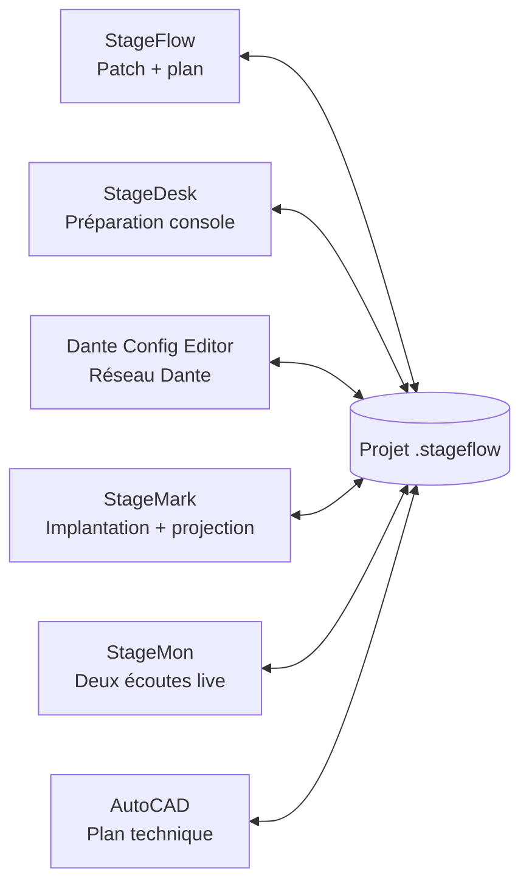

# Projets StageDesk autonomes et StageFlow partagés / Standalone StageDesk and shared StageFlow projects

**Save My Time**

StageDesk propose deux parcours explicites et complets :

- un fichier `.smtshow`, projet autonome possédé et enregistré par StageDesk ;
- un dossier `.stageflow`, projet partagé dont StageDesk lit le patch commun et écrit
  son domaine `smt/smt.json`.

Les deux formats peuvent être créés, ouverts, modifiés et enregistrés dans StageDesk.
**StageFlow n'a pas besoin d'être installé**.

StageDesk provides two explicit, complete workflows: a standalone `.smtshow`
file and a shared `.stageflow` folder whose common patch is read by Save My
Time while it owns `smt/smt.json`. Both formats can be created, opened, edited,
and saved in StageDesk. **StageFlow does not need to be installed**.

## Un seul projet, plusieurs outils

Chaque application reste utilisable seule. Elle partage les UUID et le patch,
mais écrit uniquement son domaine métier :

| Fichier | Propriétaire | Contenu |
|---|---|---|
| `project.json` | manifeste commun | identité, métadonnées et table `files` |
| `patch.json` | patch commun | groupes, paires, lignes et UUID stables |
| `smt/smt.json` | StageDesk | destination console/DAW et contexte de préparation |
| `dante/dante.json` | Dante Config Editor | configuration réseau Dante |
| `stagemark/stagemark.json` | StageMark | implantation, projection et cues |
| `monitoring/monitoring.json` | StageMon | affectations et préparation des écoutes |
| `cad/cad.json` | AutoCAD Bridge | correspondance avec les objets du plan |

## Utilisation dans StageDesk

1. **Fichier > Nouveau projet StageDesk** crée une préparation autonome ;
   **Enregistrer** ou **Enregistrer sous** produit son fichier `.smtshow`.
2. **Fichier > Ouvrir un projet StageDesk** rouvre directement un `.smtshow`.
3. **Fichier > Nouveau projet StageFlow** crée un dossier `.stageflow` partagé.
4. **Fichier > Ouvrir un projet StageFlow** ouvre un dossier `.stageflow` ;
   **Enregistrer** met à jour le patch commun et `smt/smt.json`.
5. **Importer un ancien projet StageDesk** reprend un ancien fichier `.smt`.

StageDesk importe aussi un projet StageFlow ne contenant encore que `patch.json`.
Il ajoute `smt/smt.json` au premier enregistrement sans modifier les domaines
Dante, StageMark ou CAD.

## Synchronisation et conflits

- Un watcher débouncé surveille `project.json`, `patch.json` et `smt/smt.json`.
- Sans session LIVE valide, les modifications externes restent manuelles : StageDesk
  les signale et affiche **Recharger**, mais ne remplace pas le tableau.
- Avec une session StageFlow LIVE valide et le suivi local activé, chaque patch
  externe valide est fusionné immédiatement dans le tableau visible, sans
  rappeler le snapshot ni recharger manuellement le projet.
- Une fusion à trois voies conserve ensemble les modifications locales et
  externes portant sur des champs différents. Si les deux côtés modifient le
  même champ, la valeur locale est conservée, **Conflit LIVE** signale ce champ
  et les autres changements non conflictuels restent appliqués.
- Les domaines `patch`, `smt`, puis `project` sont verrouillés dans cet ordre
  pendant l'enregistrement.
- Les empreintes SHA-256 de session détectent une modification concurrente.
- Le manifeste est relu et rebasé juste avant l'écriture afin de conserver les
  fichiers ajoutés par une autre application.
- Les fichiers déclarés sont contrôlés : chemin relatif, lien réel restant dans
  le projet, enveloppe JSON, empreinte et `projectId` commun.
- L'écriture passe par des fichiers temporaires, une sauvegarde vérifiée et une
  relecture finale. En cas d'échec, les fichiers précédents sont restaurés.

## StageFlow LIVE V1

StageDesk suit le contrat `silemio.stageflow.live` version `1.0` en lecture seule :

- seul StageFlow crée et renouvelle `.live/session.json` ; StageDesk ne crée, ne
  renouvelle et ne supprime jamais ce bail ;
- la préférence **Suivre les sessions StageFlow LIVE** est activée par défaut,
  mais reste locale à StageDesk ;
- les quatre états sont visibles en français et en anglais : **LIVE connecté**,
  **LIVE disponible · suivi désactivé**, **Autonome** et **Conflit LIVE** ;
- un bail expiré, futur, trop long, surdimensionné, non canonique, lié à un autre
  `projectId` ou traversant un lien de système de fichiers est ignoré ;
- `.live` est éphémère et n'entre ni dans les domaines métier ni dans leurs hash ;
- un événement de système de fichiers est seulement un signal : StageDesk relit et
  valide le projet complet avant toute décision ;
- le LIVE ne lance aucun matériel, socket, console ou DAW et ne remplace aucun
  geste explicite d'export réseau.

## LIVE réseau multi-postes

Le transport réseau est distinct du watcher local. L’utilisateur lance
explicitement la découverte LAN, choisit une session et saisit le code à six
chiffres affiché par le maître StageFlow. Ce code n’est ni écrit dans le projet,
ni enregistré dans les préférences.

- le badge distingue **LIVE local**, **LIVE réseau**, **Autonome** et le conflit ;
- un snapshot valide met immédiatement à jour le tableau quand le suivi est
  actif ; le réactiver applique aussi le changement déjà en attente ;
- une fusion à trois voies garde la modification locale lorsqu’un même champ a
  changé des deux côtés ; aucun hash concurrent n’est écrasé à l’aveugle ;
- StageDesk conserve en mémoire les domaines futurs ou inconnus, mais ne
  publie que `patch.json`, puis `smt/smt.json` ;
- les assets référencés par ces domaines, notamment `smt/assets/*.xlsx`, sont
  téléchargés dans un staging confiné et contrôlés par longueur et SHA-256 ;
  un nouveau classeur possédé par StageDesk est publié avant les JSON. Les
  assets des domaines tiers ne sont jamais téléchargés ni réémis par StageDesk ;
- une perte réseau annule toutes les boucles, conserve la préparation ouverte,
  la marque non enregistrée et repasse en mode autonome ;
- **Enregistrer sous** produit une copie `.smtshow` autonome et neutralise les
  liens temporaires de staging ;
- les alertes sont éphémères et limitées aux changements réels de label. Le
  refus `409 alert-mode-off` signifie simplement que le maître n’a pas activé
  ce mode ;
- une commande reçue du réseau ne peut jamais ouvrir un chemin local provenant
  d’un autre ordinateur, ni déclencher un export console, DAW ou matériel.

## Sécurité audio

Ouvrir un projet ne lance jamais une connexion réseau, une console ou un DAW.
Les chemins et hôtes mémorisés restent inactifs tant que l'utilisateur ne les
resélectionne pas et ne déclenche pas une action explicite. Les limites propres
à chaque connecteur StageDesk restent inchangées.

## Compatibilité

- `.smtshow` reste le projet StageDesk autonome, créable, ouvrable et enregistrable.
- `.smt` V5 reste importable comme ancien format.
- La capacité interne de 800 canaux et les connecteurs existants ne changent
  pas.
- StageFlow est gratuit et optionnel :
  <https://github.com/Mamat79/StageFlow/releases/latest>

## Classeur portable StageFlow V3

**Fichier > Modèle Excel > Classeur StageFlow V3** permet de créer, importer
ou exporter un classeur multi-groupes sans StageFlow. La feuille
**Commun**, les feuilles de groupes et la feuille technique masquée conservent
les UUID, les surcharges et les exclusions. Le nombre de paires ne peut pas
être réduit sous le dernier canal utilisé. Un remplacement crée au préalable
une sauvegarde voisine préfixée `Bckp_`.

Le contrat V3 a été relu dans les deux sens par StageDesk et par le service
de classeur publié avec StageFlow.

## Console de suite facultative

Sous Windows, StageDesk publie une présence locale sous l'identifiant
canonique `save-my-time` et écoute un named pipe limité à l'utilisateur
courant. Cette console reste strictement facultative : son indisponibilité ne
désactive ni les projets `.smtshow`, ni les projets `.stageflow`, ni les exports.

- heartbeat toutes les 2 secondes, bail de 8 secondes et maximum accepté de
  15 secondes ;
- messages JSON UTF-8 terminés par `LF`, limités à 64 Kio, avec nonce aléatoire ;
- une seule instance par utilisateur ; la seconde transmet sa demande à la
  première puis se ferme ;
- `--project`, `--live` et `--session` sont compris au lancement ;
- `suite.project.open` respecte le dialogue Enregistrer / Abandonner / Annuler
  et peut attendre jusqu'à 5 minutes ; les commandes rapides sont limitées à
  2 secondes ;
- les commandes exposées ouvrent la préparation, valident ou donnent le focus
  aux panneaux d'import et d'export. Elles ne déclenchent aucun export réseau.

## English quick reference

- **File > New/Open a StageDesk project** creates or opens a standalone `.smtshow`;
  **Save** and **Save As** keep that standalone format.
- **File > New/Open a StageFlow project** creates or opens a shared
  `.stageflow` folder. **Save** writes the common patch and `smt/smt.json`.
- Legacy `.smt` files remain importable.
- Without a valid LIVE session, external changes stay manual and **Reload** is explicit.
- With a valid LIVE session and local following enabled, each valid external
  patch is merged into the visible table immediately, without recalling the
  snapshot. A three-way merge keeps disjoint local and external edits together;
  same-field conflicts keep the local value and remain visibly flagged.
- Network LIVE is joined explicitly through LAN discovery and a non-persisted
  six-digit code. StageDesk publishes only `patch.json`, `smt/smt.json`, and
  its referenced `smt/assets/*` files after size and SHA-256 verification.
- Detaching or losing the session keeps the current table as an unsaved
  standalone preparation. Save As creates an autonomous `.smtshow` copy.
- StageDesk only reads the StageFlow-owned `.live/session.json` lease. It never creates,
  renews, or removes LIVE state and never sends hardware or network commands.
- Domain locks, session hashes, manifest rebase, atomic staging, verified
  backups, and final readback protect the project.
- Opening a project never starts a network or hardware connection.
