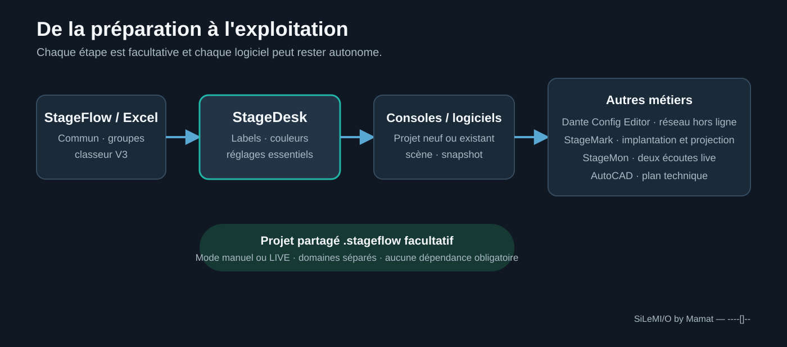

# La suite SiLeMIO — Guide de démarrage

**Un seul spectacle, plusieurs outils, sans dépendance obligatoire.**

Chaque logiciel SiLeMIO reste utilisable seul avec son projet natif. Save My
Time crée, ouvre et enregistre ainsi ses fichiers `.smtshow` sans StageFlow.
Pour partager le même patch entre plusieurs outils, il peut aussi créer, ouvrir
et enregistrer directement un dossier `.stageflow`. StageFlow est
gratuit et facultatif.

## Choisir le bon parcours

### StageDesk uniquement

1. Choisissez **Fichier > Nouveau projet StageDesk**.
2. Importez une console, un logiciel audio ou un tableau, ou partez d'une
   préparation vide.
3. Travaillez dans le tableau universel et les PatchSets.
4. Enregistrez le projet autonome au format `.smtshow`.
5. Rouvrez-le plus tard avec **Fichier > Ouvrir un projet StageDesk**.

Ce parcours ne demande ni StageFlow, ni connexion réseau, ni autre
logiciel de la suite.

### Projet partagé entre plusieurs logiciels

1. Choisissez **Nouveau projet StageFlow** ou **Ouvrir un projet StageFlow**.
2. StageDesk lit `project.json` et le patch commun `patch.json`.
3. Il enregistre son contexte dans `smt/smt.json` et met à jour le patch commun
   sous verrou, sans réécrire les domaines Dante, StageMark ou CAD.
4. Les changements indépendants sont fusionnés. Si la même valeur a été
   modifiée différemment, StageDesk signale le conflit sans écraser le
   travail externe.

StageFlow peut ensuite servir de console centrale, mais le dossier
`.stageflow` reste utilisable directement par StageDesk lorsqu'il n'est pas
installé.

## Préparer le patch dans Excel

Le menu **Classeur StageFlow V3** crée un classeur portable avec une feuille
**Commun**, une feuille par groupe et une feuille technique masquée qui conserve
les UUID. Le nombre de paires et de groupes est libre dans les limites prévues.
StageDesk peut importer un classeur créé par StageFlow et StageFlow peut
importer celui créé par StageDesk.

À l'export, une valeur commune peut être gardée, remplacée dans un groupe ou
masquée pour ce groupe. L'application refuse de réduire le classeur sous le
dernier canal utilisé afin d'éviter toute perte silencieuse.

## Utiliser le mode manuel ou LIVE

En mode manuel, **Recharger** applique une modification externe uniquement à la
demande. En mode LIVE, StageDesk suit la session publiée par StageFlow et
actualise immédiatement le tableau visible, sans rappeler le snapshot.

- les changements portant sur des champs différents sont conservés ensemble ;
- un conflit sur le même champ garde la valeur locale et reste signalé ;
- StageDesk ne crée pas la session LIVE et n'envoie aucune commande au
  matériel ;
- couper le suivi rend immédiatement l'application autonome.

## Ouvrir les autres outils depuis StageFlow

La console StageFlow peut détecter StageDesk, ouvrir le projet courant dans
sa fenêtre existante et afficher son état. Elle ne crée pas de deuxième
instance. Si le projet StageDesk contient des modifications non enregistrées,
les choix **Enregistrer**, **Ignorer** et **Annuler** restent sous le contrôle de
l'utilisateur.

| Besoin | Outil |
| --- | --- |
| Patch, groupes, classeur Excel et plan simple | StageFlow |
| Transfert de labels et réglages entre consoles et logiciels | StageDesk |
| Préparation Dante hors ligne | Dante Config Editor |
| Implantation, cues et projection | StageMark |
| Deux écoutes et exploitation live | StageMon |
| Plan technique DWG | AutoCAD avec le connecteur StageFlow |

Installez uniquement les outils nécessaires. Les téléchargements utiles restent
accessibles discrètement dans **Aide > À propos**.

---

**SiLeMI/O by Mamat — ----[]--**
