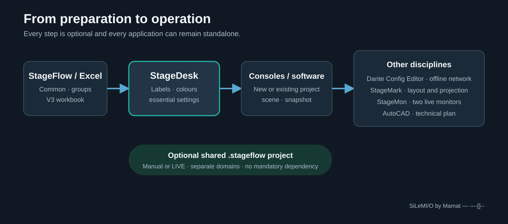

# The SiLeMIO suite — Getting started

**One show, several tools, with no mandatory dependency.**

Every SiLeMIO application remains usable on its own with its native project.
StageDesk creates, opens and saves `.smtshow` files without StageFlow. To
share the same patch between tools, it can also create, open and save a
`.stageflow` folder directly. StageFlow is free and optional.

## Choose the right workflow

### StageDesk only

1. Choose **File > New StageDesk project**.
2. Import a console, audio application or spreadsheet, or start from an empty
   preparation.
3. Work in the universal table and PatchSets.
4. Save the standalone project as `.smtshow`.
5. Reopen it later with **File > Open a StageDesk project**.

This workflow requires neither StageFlow, a network connection, nor
another suite application.

### Local StageFlow project

1. Choose **New local StageFlow project** or **Open a local StageFlow project**.
2. StageDesk reads `project.json` and the shared `patch.json`.
3. It saves its context to `smt/smt.json` and updates the shared patch under
   locks, without rewriting Dante, StageMark or CAD domains.
4. Independent changes are merged. If both sides changed the same value
   differently, StageDesk reports the conflict without overwriting the
   external work.

StageFlow may then act as a central console, but StageDesk still
uses the `.stageflow` folder directly when StageFlow is absent.

## Prepare the patch in Excel

**StageFlow V3 workbook** creates a portable workbook with a **Commun** sheet,
one sheet per group and a hidden technical sheet that preserves UUIDs. Pair and
group counts are freely selectable within the supported limits. StageDesk
can import a workbook created by StageFlow, and StageFlow can import one created
by StageDesk.

On export, a common value can be kept, overridden in one group, or hidden for
that group. The application refuses to shrink the workbook below the last used
channel so data cannot disappear silently.

## Use a local project or a StageFlow LIVE session

In a Local StageFlow project, **Reload** applies an external change only when
requested if local following is disabled. A StageFlow LIVE session is joined
explicitly through **View / join StageFlow LIVE projects…**, after choosing the
project and host computer and entering its six-digit code. Once joined, it
always updates the visible table immediately, without recalling the snapshot.

- edits to different fields are preserved together;
- a same-field conflict keeps the local value and remains visible;
- StageDesk neither creates the LIVE session nor sends hardware commands;
- leaving the session immediately returns the application to standalone use;
  no automatic reconnection is attempted;
- label-alert reception is enabled by default. Each alert remains visible until
  local acknowledgement; disabling reception acknowledges only this computer's
  backlog and re-enabling never restores old alerts.

## Open the other tools from StageFlow

The StageFlow console can detect StageDesk, open the current project in its
existing window and display its status. It never creates a duplicate instance.
If the StageDesk project contains unsaved changes, **Save**, **Discard** and
**Cancel** remain under the user's control.

| Need | Application |
| --- | --- |
| Patch, groups, Excel workbook and simple plan | StageFlow |
| Transfer labels and settings between consoles and software | StageDesk |
| Offline Dante preparation | Dante Config Editor |
| Layout, cues and projection | StageMark |
| Two monitor mixes and live operation | StageMon |
| Technical DWG plan | AutoCAD with the StageFlow connector |

Install only the tools you need. Useful download links remain discreetly
available under **Help > About**.

---

**SiLeMI/O by Mamat — ----[]--**
